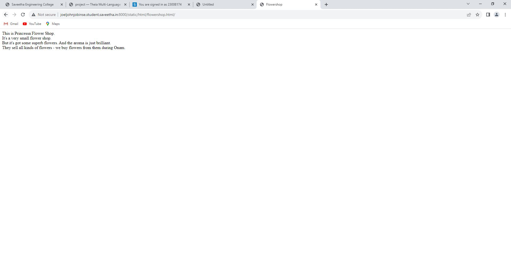

# Places Around Me
## AIM:
To develop a website to display details about the places around my house.

## Design Steps:

### Step 1:  Create a folder 'static' under the project folder 'myproj'

### Step 2: In 'static', create another folder 'html', under which the file 'index.html' should be created.

### Step 2: Go to Google Mpas and take a screenshot of your home on it along with some places around it.

### Step 2: Go to Image-Maps.com and mark 5 locations on it using the shapes used in Maps.

### Step 2: Copy the html code for the map and add it to 'index.html'

### Step 2: Create the html documents to be displayed when clicked on the location in the image map.

### Step 2: Take screenshots of the output.

### Step 2: Push it to 'README.md' and push it to the repository

## Code:
### index.html:
```html
<!DOCTYPE html>
<html>
    <head>
        <title>Map of My Home</title>
    </head>
    <body>
        
        <map name="imagemap" id="ImageMapsCom-imagemap">
        <area  alt="" title="My Home" href="http://joeljohnjobinse.student.saveetha.in:8000/static/html/home.html/" shape="rect" coords="293,339,435,392" style="outline:none;" target="_self"     />
        <area  alt="Jewelers" title="Jewelers" href="http://joeljohnjobinse.student.saveetha.in:8000/static/html/jewelers.html/" shape="rect" coords="424,294,481,339" style="outline:none;" target="_self"     />
        <area shape="rect" coords="800,704,802,706" alt="Image Map" style="outline:none;" title="Image Map" href="https://www.image-maps.com/" />
        <area  alt="Metro Station" title="Metro Station" href="http://joeljohnjobinse.student.saveetha.in:8000/static/html/metro.html/" shape="poly" coords="497,534,418,452,310,418,394,499" style="outline:none;" target="_self"     />
        <area  alt="Supermarket" title="Supermarket" href="http://joeljohnjobinse.student.saveetha.in:8000/static/html/supermarket.html/" shape="poly" coords="405,82,429,53,489,91,472,124" style="outline:none;" target="_self"     />
        <area  alt="" title="Flowershop" href="http://joeljohnjobinse.student.saveetha.in:8000/static/html/flowershop.html/" shape="poly" coords="210,502,288,544,270,573,187,534" style="outline:none;" target="_self"     />
        </map>
    </body>
</html>
```
### home.html:
```html
<!DOCTYPE html>
<html>
    <head>
        <title>Home</title>
    </head>
    <body>
        This is my home. I live in Sheikh Rashid Colony, Al Qusais, Dubai. 
        <br>
        It's a very populated area in Dubai. 
        <br>
        My home is a 2 bedroom flat. 
        <br>
        The view outside is awesome - we live right in front of the metro station, so we can see trains going in and out all the time.
    </body>
</html>
```
### metro.html:
```html
<!DOCTYPE html>
<html>
    <head>
        <title>Metro Station</title>
    </head>
    <body>
        This is Dubai Airport Free Zone Metro Station. 
        <br>
        It's one of the many other metro stations of the Dubai Metro, and one of three metro stations in Al Qusais.
        <br>
        It's on the Green Line of the Dubai Metro, starting from etisalat to Creek Metro Station.
        <br>
        Traveling on the metro is so much fun - especially exchanging in time at the interchange stations!!!
    </body>
</html>
```
### supermarket.html:
```html
<!DOCTYPE html>
<html>
    <head>
        <title>Supermarket</title>
    </head>
    <body>
        This is Talal Supermarket. 
        <br>
        It's a very popular supermarket chain in UAE.
        <br>
        It gets very crowded almost every day, especially the vegetable area. And even long queues at the billing counter! 
        <br>
        But they do give offers very often, selling goods at very cheap rates compared to others.
        <br>
        We go there every weekend to buy things for the whole week.
    </body>
</html>
```
### jewelers.html:
```html
<!DOCTYPE html>
<html>
    <head>
        <title>Jewelers</title>
    </head>
    <body>
        This is a Malabar Gold and Diamonds Jewelery Shop. 
        <br>
        It's a very popular brand not only in India, but outside India as well.
        <br>
        Not very crowded though, but it's just one of the many jewelery shops in the vicinity. 
        <br>
        It's got some BEAUTIFUL jewelery collections - especially the diamond ones.
    </body>
</html>
```
### flowershop.html:
```html
<!DOCTYPE html>
<html>
    <head>
        <title>Flowershop</title>
    </head>
    <body>
        This is Princessa Flower Shop. 
        <br>
        It's a very small flower shop.
        <br>
        But it's got some superb flowers. And the aroma is just brilliant. 
        <br>
        They sell all kinds of flowers - we buy flowers from them during Onam.
    </body>
</html>
```

## Output:
### index.html:


### home.html:


### metro.html:


### supermarket.html:


### jewelers.html:


### flowershop.html:


## Result:
Image-map has been created successfully.